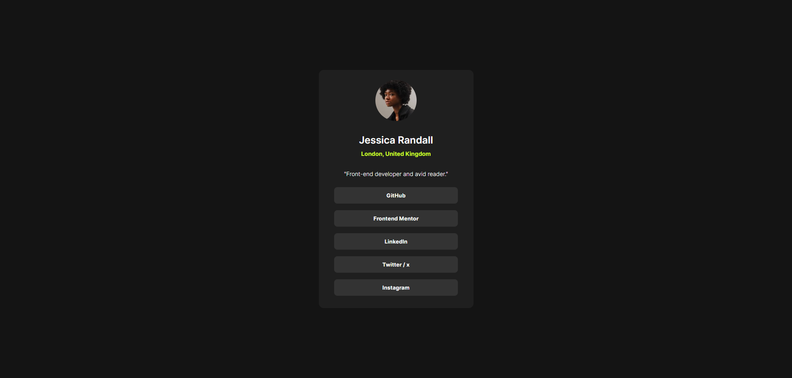

# Frontend Mentor - Social links profile solution

This is a solution to the [Social links profile challenge on Frontend Mentor](https://www.frontendmentor.io/challenges/social-links-profile-UG32l9m6dQ). Frontend Mentor challenges help you improve your coding skills by building realistic projects. 

## Table of contents

- [Overview](#overview)
  - [The challenge](#the-challenge)
  - [Screenshot](#screenshot)
  - [Links](#links)
- [My process](#my-process)
  - [Built with](#built-with)
  - [What I learned](#what-i-learned)
  - [Continued development](#continued-development)
- [Author](#author)

## Overview

### The challenge

Users should be able to:

- See hover and focus states for all interactive elements on the page

### Screenshot



### Links

- Solution URL: [GitHub Repo](https://github.com/AlexanderTejedor/Social-links-profile)
- Live Site URL: [GitHub Pages](https://alexandertejedor.github.io/Social-links-profile/)

## My process

### Built with

- Semantic HTML5 markup
- CSS custom properties
- Flexbox
- Mobile-first workflow

### What I learned

One of the greatest lessons I have learned from this challenge is the use of variables. I had used variables in CSS some time ago, but working on this project allowed me to practice more, and I feel that it yielded a very good result.

```css
:root{
    /*Colors*/
    --primary-color: hsl(75, 94%, 57%);
    --neutral-white:hsl(0, 0%, 100%);
    --neutral-grey: hsl(0, 0%, 20%);
    --neutral-drak-grey: hsl(0, 0%, 12%);
    --neutral-off-black: hsl(0, 0%, 8%);
    /*Typography*/
    --paragrapg-size: 14px;
    --normal-weight: 400;
    --medium-weight: 600;
    --bold-weight: 700;
}
```

### Continued development

For future projects, I would like to continue applying CSS variables. I would also like to strengthen my JavaScript skills. I didn't use it here, but with effort, I will be able to implement it in future challenges.

## Author

- Website - [Alexander Tejedor](https://github.com/AlexanderTejedor)
- Frontend Mentor - [@AlexanderTejedor](https://www.frontendmentor.io/profile/AlexanderTejedor)
- Twitter - [@Alexand59894016](https://x.com/Alexand59894016)